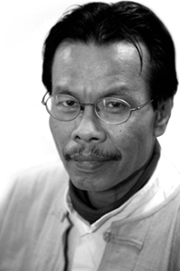

# About this blog

## This blog is about Sai Htee Saing who is my best-loved singer. I believe most of the people are from Myanmar will familar with his songs not only oldies also among young peopole. Sayar Sai Khan Leik, he is one of my favourite composer as well.

## Sai Htee Saing was a distinguished Burmese singer and songwriter of Shan descent, which featured prominently throughout his music career. Throughout his career, he recorded two to three Shan language albums and 30 to 40 Burmese language albums. He was especially known for composing country music. Vital composer of Sai Htee Saing's songs is Sai Kham Leik.

#### All the informations were refrenced from wiki.

### [Ref-wiki-URL](https://my.wikipedia.org/wiki/%E1%80%85%E1%80%AD%E1%80%AF%E1%80%84%E1%80%BA%E1%80%B8%E1%80%91%E1%80%AE%E1%80%B8%E1%80%86%E1%80%AD%E1%80%AF%E1%80%84%E1%80%BA?fbclid=IwAR0xYYC1YT9rUu-ipAbS3Wlymtv3C1YZp-GizgNUTQJcIv-P67QSkKZOl08)

