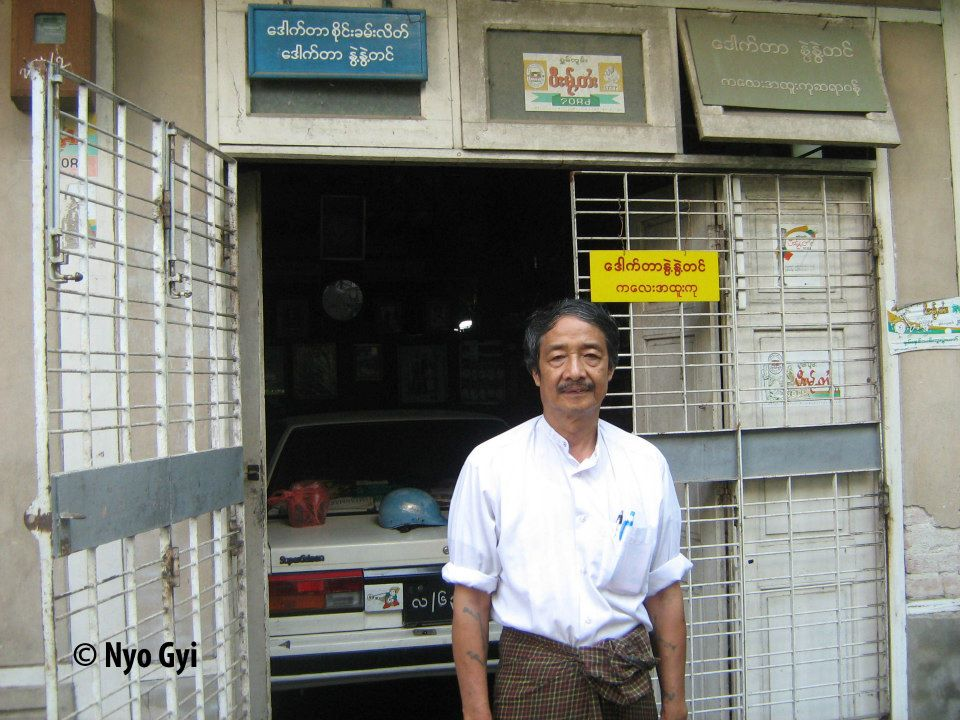

# သိပ်သိပ်ချစ်ရတဲ့ နွဲ့တင်ရယ်
## နွဲ့တင်အတွက်သီချင်းတစ်ပုဒ်(သို့မဟုတ်) ဒေါက်တာစိုင်းခမ်းလိတ်၏ သမုဒယရုပ်ပုံလွှာ

#### ဦးထီး အကြောင်း ပြောရင် ဆရာ စိုင်းခမ်းလိတ် အကြောင်းက မပါမပြီး ဆိုသလို ပါပဲ။
#### အခု တခေါက်မှာ တော့ ဦးထီး (စိုင်းထီးဆိုင်) သီဆို ပြီး ဆရာ စိုင်းခမ်းလိတ်  ရေးသားထားတဲ့ နွဲ့တင် သီချင်း ဖြစ်ပေါ်လာပုံကို ဖတ်ရှု ကြရမှာ ဖြစ်ပါတယ်။
လူရည်ချွန်ဖြစ်တဲ့ နွဲ့နွဲ့တင်ကတော့ ရုပ်လှတယ်။ စာတော်တယ်။ အဲဒီခေတ်တုံးက ကျောင်းမှာ စူပါစတားပေါ့။ ကျောင်းသားတွေအားလုံး နွဲ့နွဲ့တင်ကို အားကျသလို စိုင်းခမ်း လိတ်တစ်ယောက်လည်း သူများနည်းတူ နွဲ့နွဲ့တင်ကို အားကျမိသူပါ။
သူတို့နှစ်ယောက်ရဲ့ ပွဲဦးထွက်ဇာတ်လမ်း တစ်ပုဒ်ကတော့ ကျောင်းနံရံကပ်စာစောင် ကနေ စခဲ့တယ်။ နံရံကပ်စာစောင်ဆိုတာက စာပေဝါသနာပါတဲ့ ကျောင်းသားတွေ လွတ်လပ် စွာ ကဗျာ၊ ဆောင်းပါး၊ ဝတ္ထုတိုတွေရေးပြီး ဆရာဆရာမများက ရွေးချယ်ပြီး ကောင်းတဲ့ဟာ တွေကိုကျောက်သင်ပုံးမှာ လှပစွာ ပြန်လည် ကပ်ထားပေးတယ်။ ကျောင်းသူကျောင်းသား တွေက ဝိုင်းကြည့်ကြတာပေါ့။ အဲဒီနံရံကပ်စာစောင်မှာ စိုင်းခမ်းလိတ်က ကဗျာလေးတစ်ပုဒ် ရေးကာ သွားကပ်ထားလိုက်တယ်။ သူ့ရဲ့ ခံစားချက်ကို တင်ပြတာပါ။ ဒါပေမယ့် သူတင်ပြချက် ကတော့ အသွားနှစ်ဖက် ရှိတဲ့ ကဗျာလေးပါ။ ကဗျာခေါင်းစဉ်ကိုက လူရည်ချွန်ကို ရအောင်ယူမည် တဲ့။ ကျောင်းသားတွေ အဲဒီကဗျာလေးကို ဖတ်ပြီးတော့ ဟိုးလေးတကျော်ဖြစ်သွားတာ ပေါ့။ လူသတင်း လူချင်းဆောင်ဆိုသလို နွဲ့နွဲ့တင်လည်း ကြားသိသွားတယ်။ စုံစမ်းကြည့်တော့ ရေးတဲ့သူက စိုင်းခမ်းလိတ်ဖြစ်နေတော့ ဆရာဆရာမတွေ ကျောင်းသားကျောင်းသူတွေအား လုံး အဲဒီအကြောင်းကို စိတ်ဝင်စားနေကြတယ်။ နွဲ့တင်ကတော့ မိန်းမသားတစ်ယောက် အနေ နဲ့ သူမကို ယခုလို စောင်းလား ချိတ်လား တင်စီးပြီး ရေးထားတာကို မြင်ရတော့ မခံချင်တာ အမှန်ပါ။ ဒီကျောင်း တစ်ကျောင်းလုံးမှာ သူမတစ်ယောက်ထဲသာ လူရည်ချွန်ဖြစ်နေလေတော့ စိုင်းခမ်းလိတ်က သူမကို ရည်ရွယ်ပြီး တမင်သက်ကက် ရေးတဲ့အကြောင်း ကျောင်းအုပ်ဆရာ ကြီးကို သွားတိုင်ပါလေရော။ ဒီကိစ္စကို ကျောင်းအုပ်ကြီးကိုယ်တိုင် စိုင်းခမ်းလိတ်ကို ရုံးခန်းမှာ ခေါ်တွေ့တယ်။ စိုင်းခမ်းလိတ်က ပြုံးပြုံးနဲ့ပဲ အဖြေပေးလိုက်တယ်။
`ကျွန်တော် သူမလို လူရည်ချွန်ဖြစ်ချင်လို့ လူရည်ချွန်ကို ရအောင်ယူမယ်လို့ ရေးတာ ဟာ ကျွန်တော်ရဲ့ ရည်ရွယ်ချက်ပါ`တဲ့။ ဒီလိုနဲ့ သူတို့နှစ်ယောက်ရဲ့ ပြဿနာလည်း ပြေလည် သွားတယ်။ တစ်ယောက်နဲ့ တစ်ယောက်လည်း ခင်မင်ရင်းနီးသွားတယ်။ သူတို့နှစ်ယောက်ရဲ့ ဇာတ်လမ်းအစ လူရည်ချွန်ကလို့ ဆိုရပါလိမ့်မယ်။
ရည်ရွယ်ချက်ရှိတဲ့အတိုင်း နဝမတန်းရောက်တော့ စိုင်းခမ်းလိတ်လည်း လူရည်ချွန် အဖြစ် ရွေးချယ်ခံခဲ့ရတယ်။ နွဲ့တင်ကလည်း လူရည်ချွန်နှစ်ထပ်ကွမ်း ဖြစ်ပြန်တယ်။ (ဒသမ တန်းလည်း နွဲ့နွဲ့တင်က လူရည်ချွန် သုံးထပ်ကွမ်းအဖြစ် ထပ်မံရွေးချယ်ခံရပြန်တယ်) မေမြို့ လူရည်ချွန်အနေနဲ့ သူတို့နှစ်ယောက် လူရည်ချွန်ခရီးအဖြစ် အတူတူသွားလာကြရလို့ ပိုပြီး ခင်မင်ရင်းနီးလာပါတော့တယ်။
ဒေါက်တာစိုင်းခမ်းလိတ်ရဲ့ သီချင်းကောင်းတွေ၊ စာသားလှလှတွေ ပေါ်ထွက်လာဖို့ အဓိက အိပ်မက်လှလှပေးတဲ့သူကတော့ နွဲ့နွဲ့တင်ပဲဖြစ်တယ်။ ဗမာသီချင်း အပုဒ် ၆၀၀ ကျော် ထဲမှာ နွဲ့နွဲ့တင်ကို ပတ်သက်တဲ့ အချစ်အကြောင်းတွေ အများကြီး တွေ့ရပါတယ်။ အထင်ရှား ဆုံးကတော့ “ သိပ်သိပ်ချစ်ရတဲ့ နွဲ့တင်“ နဲ့ “ ဒို့နှစ်ယောက်ရဲ့ အချစ်“ ပဲဖြစ်တယ်။ အဲဒါက လူရည်ချွန်ကို ရအောင်ယူမယ်ဆိုတဲ့ ရည်ရွယ်ချက်က စခဲ့တာ။
သူတို့နှစ်ယောက်ရဲ့ ဇာတ်လမ်းကတော့ ရှစ်တန်းကျောင်းသားဘဝက စခဲ့တယ်။ ကိုးတန်းရောက်တော့ အတူတူ လူရည်ချွန်ဖြစ်ပြီး ဒေသန္တရ ဗဟုသုတ အတူတူသွားခဲ့ရလို့ ပိုမို ရင်းနီးခဲ့တယ်။ ဆယ်တန်းရောက်တော့ စိုင်းခမ်းလိတ်က နမ္မတူကို ပြန်သွားရတယ်။ သို့သော် ဆေးတက္ကသိုလ်တက်တော့ မန်းမြေမှာ ပြန်ဆုံခဲ့ကြတယ်။ ဆရာတူတပည့်ဘဝနဲ့အတူ ကျောင်းနေဘက်မှာ ခင်ခဲ့ကြတဲ့ ခင်မင်မှုဟာ အခြားကျောင်းသားတွေအကြားကို ရောက်သွား ရင် ပိုမိုပြီး အလေးအနက်ရှိလာတတ်ကြတယ်။ ဒါကြောင့် စိုင်းခမ်းလိတ်နဲ့ နွဲ့နွဲ့တင်တို့ရဲ့ ခင်မင်မှုဟာလည်း ရင်းနီးမှုကို ပိုပြီးတော့ ဖြစ်စေခဲ့တယ်။
စိုင်းခမ်းလိတ် ကျောင်းပျက်လို့ အတန်းမတက်ခဲ့ရင် သူ့ကို ကူညီပေးခဲ့တဲ့သူက နွဲ့နွဲ့တင်ပဲဖြစ်တယ်။ သူ့ရဲ့ မှတ်စုစာအုပ်တွေဟာ များသောအားဖြင့် နွဲ့နွဲ့တင်ရဲ့ လက်ရေးတွေသာများပါတယ်။ လူတစ်ယောက်နဲ့ တစ်ယောက် ချစ်ခင်ရင်းနီးဖို့ ဆိုတာ (၁) ရှေးဘဝတုံးက မေတ္တာရေစက်ရှိခဲ့ကြတယ်။ (၂) ဒီဘဝမှာ တစ်ယောက်ကို တစ် ယောက်ကူညီဖေးမခဲ့ကြတယ်။ ဒီအကြောင်းနှစ်ခုကြောင့် တစ်ယောက်ကို တစ်ယောက် ချစ် ကြိုက်သွားကြတာပဲ။ သူတို့နှစ်ယောက်ကတော့ နှစ်ခုစလုံးကြောင့်ထင်တယ်။ စိုင်းခမ်းလိတ် လည်း လူရည်ချွန်ကို ရအောင်ယူမယ် ဆိုတဲ့ သူ့ရည်ရွယ်ချက်အတိုင်း ၁၉၇၃ ခုနှစ်မှာ လူရည်ချွန်သုံးထပ်ကွမ်းဖြစ်တဲ့ နွဲ့နွဲ့တင်နဲ့ လက်ထပ်လိုက်ကြတယ်။
အိမ်ထောင်ပြုဖို့အတွက် စိုင်းခမ်လိတ်တစ်ယောက် အတွေးတွေများစွာနဲ့ မိုးလင်းခဲ့ပေါင်း မနဲတော့ပါ။ နွဲ့နွဲ့တင်နဲ့ အိမ်ထောင်ပြုတဲ့ကိစ္စကို သူ့ရဲ့ သီချင်းဖြစ်တဲ့ `ဒို့နှစ် ယောက်ရဲ့အချစ်“သီချင်းကို ခံစားကြည့်ရင် နားလည်ကြမှာပါ။ သူနဲ့ မဆုံဖြစ်ခဲ့တဲ့ ရှမ်းမင်း သမီးများအတွက်လည်း ရှမ်းသီချင်းအချို့ စိုင်းခမ်းလိတ်ရေးထားတာ ရှိပါတယ်။ အဓိပ္ပါယ်အချို့ကတော့ “ တစ်ညလုံး နိုးခဲ့သော်လည်း အိပ်ယာကမထဘဲနဲ့ မိုးလင်းတဲ့အခါ ငါ့ကို မှတ်မိရင်လည်း မခေါ်နဲ့တော့“ တဲ့။ နောက်တစ်ပုဒ်ကတော့ `လွယ်ဆမ်ဆစ်` သီချင်း ပါ။ အိမ်ထောင်ပြုပြီဆိုရင် အမျိုးသားက အိမ်ထောင်ဦးစီးတာဝန်ကို ဦးလည်မသုန် ထမ်းရွက်ရ မှာဖြစ်ပါတယ်။ အဲဒီတာဝန်ကို ကျေပြွန်အောင် ဒေါက်တာစိုင်းခမ်းလိတ် ထမ်းဆောင်ခဲ့လို့ သူရေးတဲ့ `ဒီတောင်ကို မောင်ဖြိုပါ့မယ်`ဆိုတဲ့သီချင်းက ပေါ်လွင်စေခဲ့တယ်။
နောက်ပြီးတော့ သူများရဲ့ သမီးပျိုကို လက်ထပ်ယူပြီး မိမိရဲ့ ကြင်ယာအပေါ် ကတိ သစ္စာမရှိခဲ့ရင်၊ အိမ်ထောင်ရေးတာဝန် မကျေပြွန်ခဲ့ရင် `အလကားလူ` ဆိုပြီး အများရဲ့ ကဲ့ရဲ့မှုကို ခံရမယ်။ ဒေါက်တာစိုင်းခမ်းလိတ်လဲ သူ့အချစ်ဟာ သူများထက်မလျှော့ကြောင်း `မန္တလေးရောက် ရှမ်းတစ်ယောက်`သီချင်းက `မန်းပျိုဖြူတစ်ယောက်ကို ရှမ်းချစ်လည်း ဗမာထက် မလျှော့တာ တကယ်တမ်းပြခဲ့တယ်`လို့ ဆိုထားတယ်။

Ref- © content were copied from Facebook

click-the-icon-for-listen
[🎧](https://soundcloud.com/user-357364716/zfzjcp3rmmhq) 